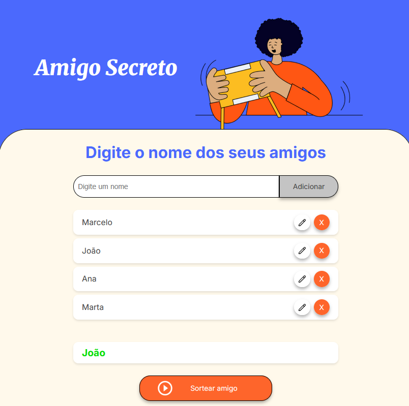

# 🎁 Amigo Secreto

Aplicação web desenvolvida em **HTML, CSS e JavaScript** para organizar e sortear amigos de forma simples e interativa.

Este projeto foi criado como parte do **Challenge Oracle Next Education (ONE) + Alura**.

---

## 🚀 Demonstração



---

## ✨ Funcionalidades

- ➕ Adicionar amigos
- 📝 Editar nomes já cadastrados
- ❌ Remover amigos da lista
- 🎲 Sortear amigos aleatoriamente
- 🔄 Reset automático da lista quando todos já foram sorteados

---

## 🛠️ Tecnologias utilizadas

- **HTML5** → estrutura da aplicação
- **CSS3** → estilização e responsividade
- **JavaScript (ES6+)** → manipulação do DOM, eventos e lógica do sorteio

---

## 📦 Como executar o projeto

1. Clone este repositório:
  ```bash
    git clone https://github.com/seuusuario/amigo-secreto.git
  ```

2. Acesse a pasta do projeto:
  ```bash
    cd amigo-secreto
  ```
3. Abra o arquivo `index.html` no navegador.

## 📚 Sobre o Challenge ONE

Este projeto foi desenvolvido como parte do programa Oracle Next Education (ONE) em parceria com a Alura.
O objetivo do desafio é aplicar os conceitos de lógica de programação, manipulação de DOM e boas práticas de desenvolvimento web.

## 📄 Licença

Este projeto está sob a licença MIT.